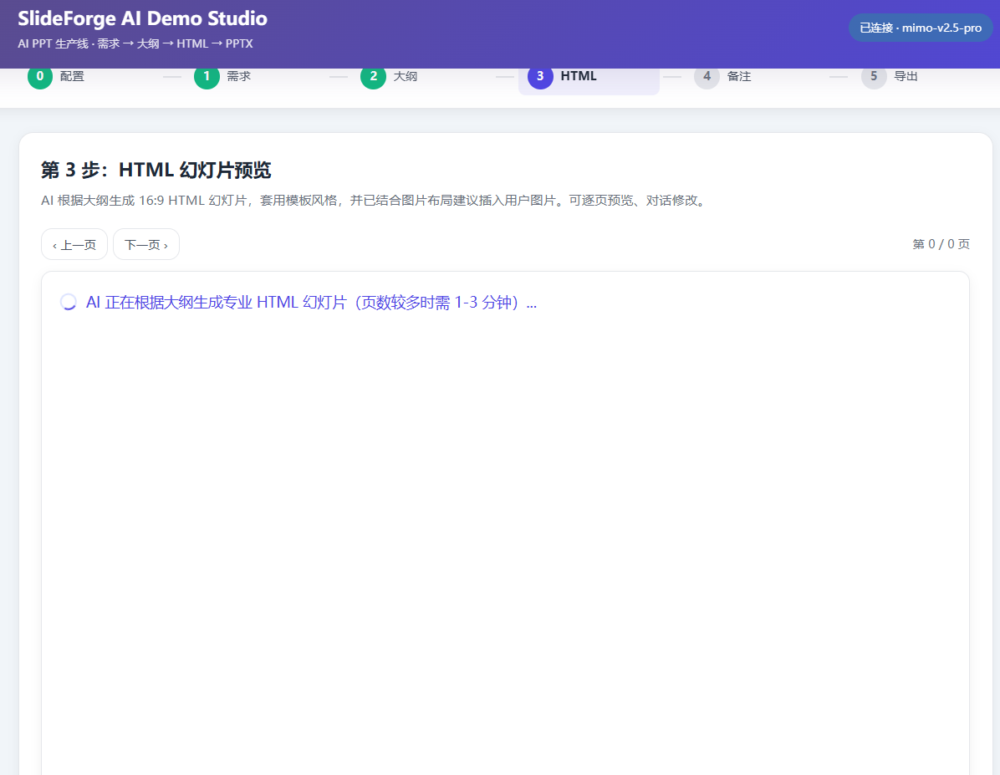

<div align="center">

[](./requirements.txt)
[](./trae-demo/app.py)
[](#quick-start)
[](./scripts/export_html_to_pptx.py)
[](./prompts/01_outline_prompt.md)
[](./templates/academic-16x9/template.html)
[](#slideforge-ai)
[](./LICENSE)

# SlideForge AI

**An AI PPT production line: requirements -> Markdown outline -> HTML slides -> speaker notes -> PPTX.**

[English](./README.md) | [中文](./README_CN.md)

</div>

## SlideForge AI Demo Studio

SlideForge AI Demo Studio is an interactive local demo for turning a presentation request into a reviewable, exportable deck.

It is designed for office workers, researchers, students, teachers, and product teams who want to turn a presentation request into a usable deck through a reviewable workflow instead of a fragile one-shot AI generation.

```text
PPT requirement + optional images + optional PPT template
  -> AI requirement analysis
  -> Markdown PPT outline
  -> 16:9 HTML slide preview
  -> speaker notes
  -> PPTX export
```

The demo keeps every stage editable and conversational: users can revise the outline, HTML slides, and speaker notes before exporting.

## Demo Screenshots

| Home | Requirement | Outline |
| --- | --- | --- |
|  |  |  |

| HTML Preview | Speaker Notes | PPTX Export |
| --- | --- | --- |
|  |  |  |

More development screenshots are stored in [docs/assets/trae-demo](./docs/assets/trae-demo).

## Quick Start

Clone the repository:

```bash
git clone https://github.com/xiejhhhhhh/slideforge-ai.git
cd slideforge-ai/trae-demo
```

Install the demo dependencies:

```bash
pip install -r requirements.txt
playwright install chromium
```

Start the demo:

```bash
python app.py
```

Open:

```text
http://127.0.0.1:5000
```

On Windows, you can also double-click:

```text
trae-demo/start.bat
```

Frontend-only preview is also possible by opening [trae-demo/index.html](./trae-demo/index.html), but PPTX export needs the Flask helper backend.

## AI API Configuration

The demo uses OpenAI-compatible chat APIs from the browser. You can configure:

- API Base URL
- model name
- API Key
- optional vision model

API keys are stored only in browser `localStorage`. This repository intentionally commits only [.env.example](./trae-demo/.env.example), not private keys.

## Core Features

- AI requirement understanding for audience, duration, topic, style, and delivery format.
- Markdown outline generation with timing, slide titles, content bullets, narration focus, visual suggestions, and layout guidance.
- HTML slide generation from the current Markdown outline, keeping slide count aligned.
- Uploaded image support for PNG/JPG/JPEG/WEBP/SVG/GIF workflows.
- Speaker note generation after HTML confirmation.
- Three PPTX export modes: screenshot, native editable drawing, and template filling.
- Optional `.pptx` template parsing for colors, fonts, slide ratio, and style hints.
- Local delivery workflow with downloadable outline, HTML, notes, and PPTX.

## Project Structure

```text
slideforge-ai/
  trae-demo/                    interactive contest demo
    index.html                  frontend app
    app.py                      Flask helper backend
    start.bat                   Windows one-click launcher
    requirements.txt            demo dependencies
    sample_input/               safe sample requirement
  docs/
    assets/trae-demo/           README screenshots
    workflow.md                 original workflow notes
    layout-guidelines.md        layout and revision rules
  prompts/                      reusable AI prompt templates
  templates/academic-16x9/      base HTML slide template
  examples/research-demo/       sanitized demo presentation
  scripts/                      HTML rendering and PPTX export scripts
```

Generated outputs, private test materials, `.trae/`, cached files, `.pptx`, PDFs, and local screenshots are ignored by default.

## Documentation

- [Demo README](./trae-demo/README.md)
- [Workflow guide](./docs/workflow.md)
- [Layout guidelines](./docs/layout-guidelines.md)

## Best Use Cases

- research group meeting slides
- paper progress reports
- course presentations
- project roadshows
- proposal decks
- technical summaries with figures and speaker notes

## Design Principle

SlideForge AI does not try to replace human judgment. It turns AI PPT generation into a staged, inspectable workflow so humans can review structure, layout, images, notes, and final export quality.

## License

MIT License.
