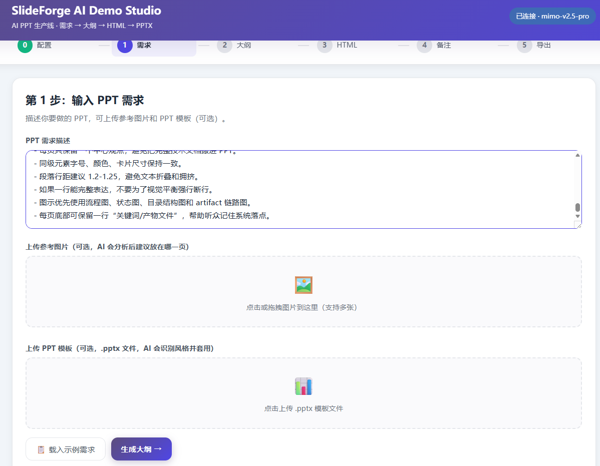
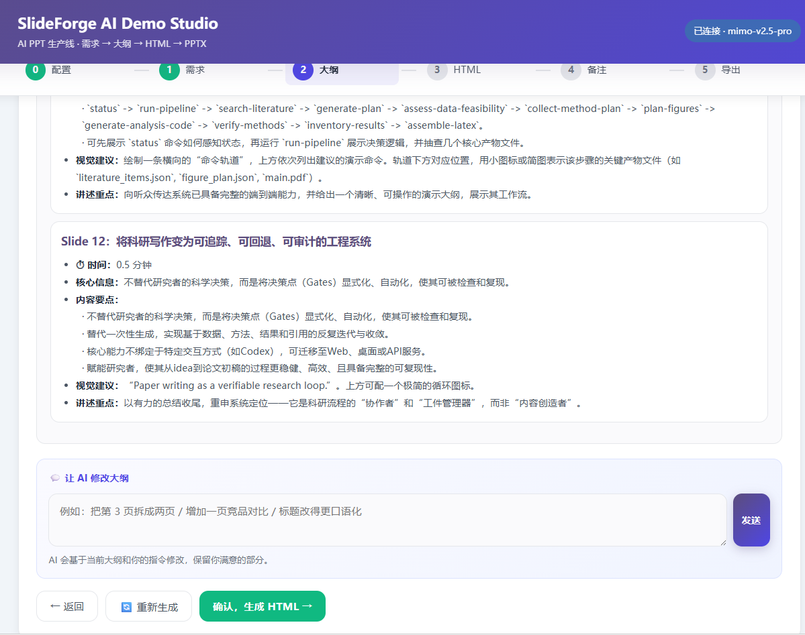
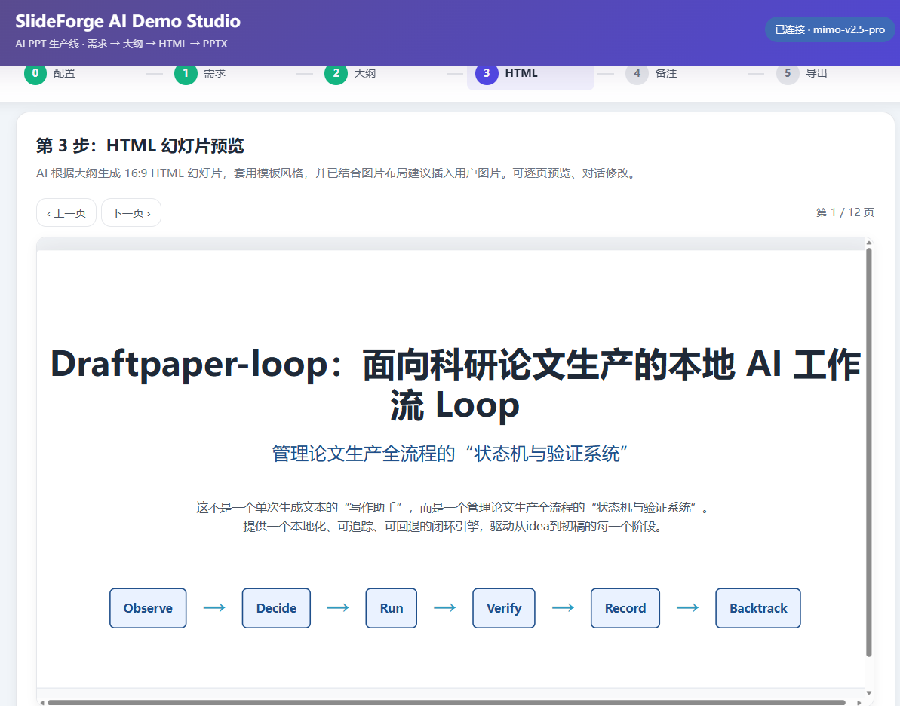
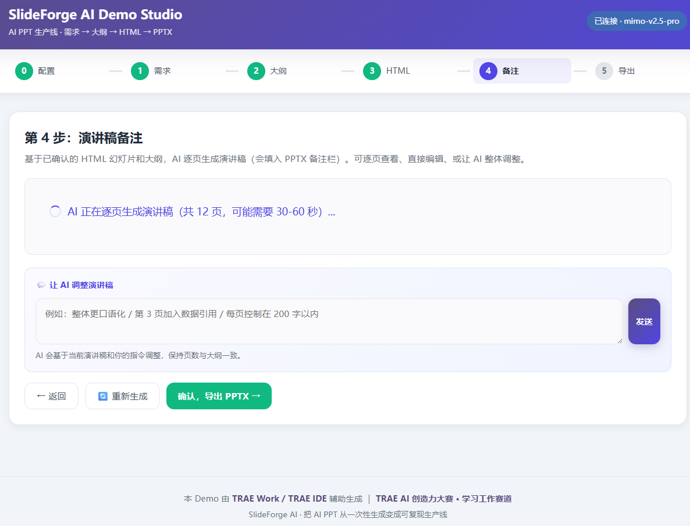
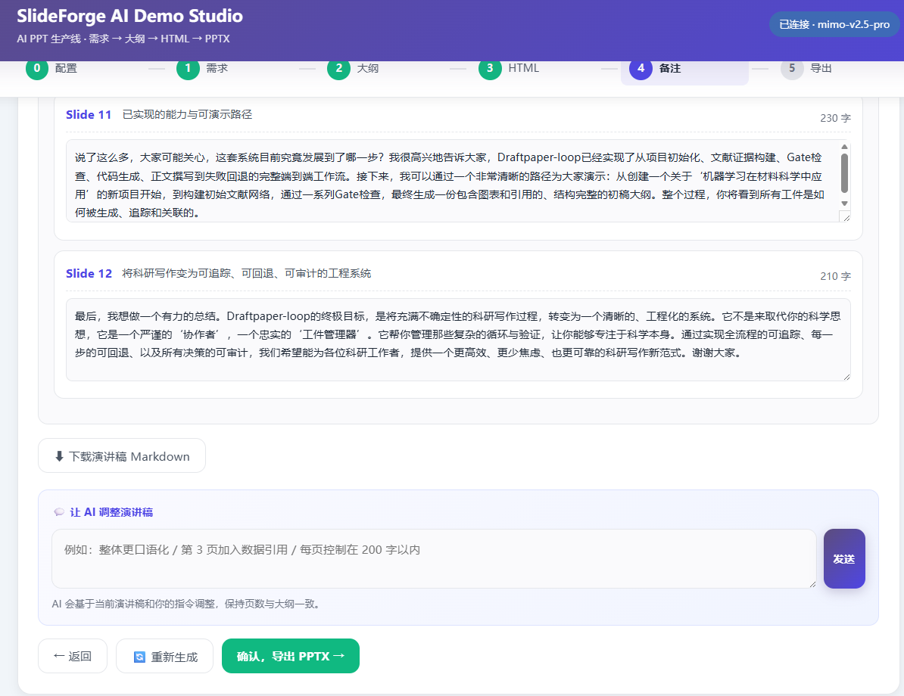
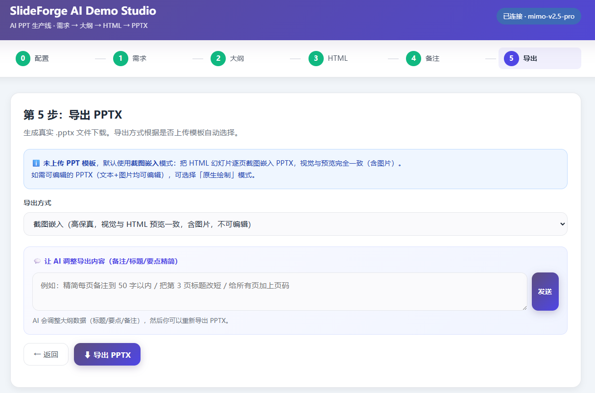

# SlideForge AI Demo Studio

> TRAE AI 创造力大赛 · 学习工作赛道 · 初赛 Demo

SlideForge AI Demo Studio 是一个可交互的 **AI PPT 生产线** Demo：从 PPT 需求出发，依次生成 Markdown 大纲、HTML 幻灯片、演讲稿备注，并导出 PPTX。每个环节都可以继续与 AI 对话调整。

## Demo 截图

| 流程首页 | 需求输入 | HTML 预览 |
| --- | --- | --- |
|  |  |  |

| 演讲稿 | PPTX 导出 | Demo 总结 |
| --- | --- | --- |
|  |  |  |

## 快速开始

### 方式一：一键启动（Windows 推荐）

```bash
# 首次运行会自动检查依赖
start.bat
```

启动后访问：

```text
http://127.0.0.1:5000
```

### 方式二：手动启动

```bash
cd trae-demo
pip install -r requirements.txt
playwright install chromium
python app.py
```

### 方式三：仅前端预览

直接双击 `index.html` 可以查看 UI 和部分前端流程；如果需要截图导出或 PPTX 导出，请使用 Flask 后端方式启动。

## 6 步工作流

| 步骤 | 功能 | 说明 |
| --- | --- | --- |
| Step 0 | 配置 AI 连接 | 支持 OpenAI / DeepSeek / GLM / MiMo 等 OpenAI 兼容接口，Key 仅保存在浏览器 |
| Step 1 | 输入 PPT 需求 | 粘贴需求，可上传参考图片和 `.pptx` 模板 |
| Step 2 | 生成 Markdown 大纲 | AI 先深度分析主题、受众、时长和风格，再生成专业大纲 |
| Step 3 | 生成 HTML 幻灯片 | 根据当前大纲生成 16:9 HTML PPT，保持页数一致 |
| Step 4 | 生成演讲稿备注 | 逐页生成口播稿，可编辑、可对话调整 |
| Step 5 | 导出 PPTX | 支持截图嵌入、原生可编辑绘制、模板填充三种模式 |

## 设计重点

- **不是一次性生成**：把 PPT 制作拆成可检查、可修改的阶段。
- **大纲和 HTML 强绑定**：HTML 必须基于当前 Markdown 大纲生成，避免前后脱节。
- **图片进入页面布局**：图片不是单独堆成图库，而是插入对应幻灯片区域。
- **备注进入交付物**：演讲稿备注在导出 PPTX 时写入备注栏。
- **模板可选**：无模板时使用截图或原生绘制；有模板时走模板填充模式。

## 三种 PPTX 导出模式

| 模式 | 视觉保真 | 可编辑性 | 适用场景 |
| --- | --- | --- | --- |
| `screenshot` 截图嵌入 | 高，与 HTML 预览一致 | 低，整页为图片 | 快速生成可汇报 PPT |
| `native` 原生绘制 | 中，重建文本和图片 | 高 | 需要后续继续编辑 |
| `template_fill` 模板填充 | 尽量套用上传模板风格 | 中到高 | 用户指定 `.pptx` 模板 |

## AI API 与隐私

前端会调用 OpenAI 兼容接口。用户需要自行填写：

- API Base URL
- 模型名称
- API Key
- 可选视觉模型名称

安全说明：

- API Key 仅保存在浏览器 `localStorage`。
- 仓库不提交真实 API Key。
- `.env.example` 只是后端运行示例，不包含密钥。
- `outputs/`、私有测试材料和上传模板默认不提交。

## 后端 API

| 接口 | 方法 | 功能 |
| --- | --- | --- |
| `/api/health` | GET | 健康检查 |
| `/api/parse_template` | POST | 解析 `.pptx` 模板比例、配色、字体和样式 |
| `/api/screenshot` | POST | 把 HTML 幻灯片截图为 PNG |
| `/api/export_pptx` | POST | 导出 PPTX |

## 文件结构

```text
trae-demo/
  index.html              前端应用，HTML/CSS/JS 内联
  app.py                  Flask 辅助后端
  start.bat               Windows 一键启动脚本
  requirements.txt        Demo 依赖
  .env.example            环境变量示例，不含密钥
  README.md               本文件
  session-evidence.md     TRAE Session 与截图记录模板
  sample_input/
    sample_requirement.txt
    README.md
```

未提交内容：

- `outputs/` 生成的 PPTX、截图、临时 HTML。
- `Chenwei_Test/` 私有真实测试材料。
- `.trae/` 本地 IDE 配置。
- `__pycache__/` 缓存文件。

## 参赛材料

- [Session 证据记录](./session-evidence.md)
- [比赛发帖草稿](../docs/trae-demo-forum-post.md)
- [README 展示截图](../docs/assets/trae-demo)

## 与主项目关系

本 Demo 是 [SlideForge AI](https://github.com/xiejhhhhhh/slideforge-ai) 的可交互展示版本。主项目沉淀了提示词、HTML 模板、渲染脚本和 PPTX 导出工具；Demo 则把这些能力压缩为一条浏览器中可体验的工作流。

## 协议

MIT License.
